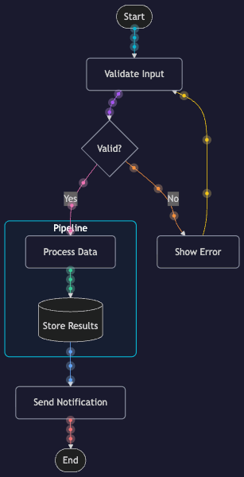
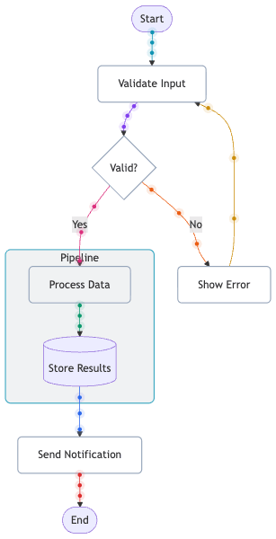

# mermaid-animator &nbsp; [](https://github.com/dsablic/mermaid-animator/actions/workflows/ci.yml) [](https://www.npmjs.com/package/mermaid-animator) [](./LICENSE)

Animated, interactive Mermaid.js diagram viewer. Renders Mermaid code as a live SVG with colorized edges and glowing dots that travel along connections, plus pan, zoom, and click-to-inspect.

**[Try the playground](https://dsablic.github.io/mermaid-animator/demo/)**

Supports all Mermaid diagram types: flowcharts, sequence diagrams, class diagrams, state diagrams, ER diagrams, and more.

<p align="center">
  
  
</p>

## Features

- Colorized edges with glowing dots that travel along all connections simultaneously
- Each edge gets a distinct color from a vibrant palette
- Rounded nodes with cluster-colored borders
- Dark and light themes built in, with full custom theme support
- Pan and zoom via mouse/touch, with keyboard shortcuts
- Click any node to highlight its connections and see a detail popover
- GIF export with traveling dot animation (separate entry point, keeps main bundle small)
- Works with all Mermaid diagram types
- Ships as ESM and UMD, with TypeScript declarations

## Installation

```bash
npm install mermaid-animator mermaid
```

## Usage

```html
<div id="diagram" style="width: 800px; height: 600px;"></div>

<script type="module">
  import { MermaidAnimator } from 'mermaid-animator'

  const animator = await MermaidAnimator.create(
    document.getElementById('diagram'),
    `graph TD
      A[Start] --> B{Decision}
      B -->|Yes| C[Process]
      B -->|No| D[End]
      C --> D`
  )
</script>
```

### Options

```js
const animator = await MermaidAnimator.create(container, code, {
  theme: 'dark',       // 'dark', 'light', or a custom Theme object
  dotSpeed: 0.008,     // dot travel speed (higher = faster)
  dotsPerEdge: 3,      // number of dots per edge
  dotRadius: 3,        // dot size in SVG units
  pan: true,           // enable pan
  zoom: true,          // enable zoom
  inspect: true,       // enable click-to-inspect/hover-to-highlight
  minZoom: 0.1,
  maxZoom: 5,
  mermaid: {}          // extra options passed to mermaid.initialize()
})
```

### Themes

Built-in themes: `'dark'` (default) and `'light'`.

```js
// Dark theme (default)
MermaidAnimator.create(container, code, { theme: 'dark' })

// Light theme
MermaidAnimator.create(container, code, { theme: 'light' })

// Custom theme
MermaidAnimator.create(container, code, {
  theme: {
    name: 'midnight',
    background: '#0f172a',
    mermaidTheme: 'dark',
    edgeColors: ['#38bdf8', '#c084fc', '#fb7185', '#fbbf24'],
    dotGlowOpacity: 0.35,
    nodeStrokeWidth: 2,
    nodeFillOpacity: 0.2,
    nodeBorderDefault: '#475569',
    clusterStrokeWidth: 1.5,
    clusterFillOpacity: 0.1,
    clusterBorderOpacity: 0.8,
  }
})
```

The `Theme` type is exported for TypeScript users:

```ts
import type { Theme } from 'mermaid-animator'
```

### Methods

```js
animator.replay()           // restart dot animation
animator.fitToView()        // reset zoom/pan
animator.update(newCode)    // re-render with new Mermaid code
animator.inspect('nodeId')  // programmatically inspect a node
animator.destroy()          // cleanup
```

### Events

```js
animator.on('animationStart', () => {})
animator.on('animationEnd', () => {})
animator.on('nodeClick', (node) => {})
```

### CLI

Generate animated GIFs from the command line:

```bash
# From a file
mermaid-animator diagram.mmd -o output.gif

# With options
mermaid-animator diagram.mmd -o output.gif --theme light -W 1024 -H 768

# From stdin
cat diagram.mmd | mermaid-animator -o output.gif

# To stdout (pipe to another tool)
mermaid-animator diagram.mmd > output.gif
```

#### CLI Options

| Option | Default | Description |
|--------|---------|-------------|
| `-o, --output <file>` | stdout | Output GIF path |
| `-t, --theme <name>` | `dark` | `'dark'` or `'light'` |
| `-W, --width <px>` | 800 | Max width (aspect ratio preserved) |
| `-H, --height <px>` | 600 | Max height (aspect ratio preserved) |
| `--fps <n>` | 12 | Frames per second |
| `--frames <n>` | 60 | Total animation frames |

Requires `puppeteer` to be installed (`npm install puppeteer`).

### GIF Export

Export animated diagrams as GIF files with traveling dots. Available as a separate import to keep the main bundle small.

```js
import { exportGif } from 'mermaid-animator/export'

const gifBytes = await exportGif(`graph TD
  A[Start] --> B{Decision}
  B -->|Yes| C[Process]
  B -->|No| D[End]
  C --> D`, {
  theme: 'dark'
})

// Download
const blob = new Blob([gifBytes], { type: 'image/gif' })
const url = URL.createObjectURL(blob)
const a = document.createElement('a')
a.href = url
a.download = 'diagram.gif'
a.click()
```

#### Export Options

| Option | Default | Description |
|--------|---------|-------------|
| `theme` | `'dark'` | `'dark'`, `'light'`, or a custom `Theme` object |
| `width` | 800 | Max GIF width in pixels (aspect ratio preserved) |
| `height` | 600 | Max GIF height in pixels (aspect ratio preserved) |
| `fps` | 12 | Frames per second |
| `totalFrames` | 60 | Total animation frames (controls loop duration) |
| `dotsPerEdge` | 3 | Number of dots traveling per edge |
| `dotRadius` | 3 | Dot radius in SVG units |
| `background` | from theme | Background color (overrides theme) |
| `mermaid` | `{}` | Extra options passed to mermaid.initialize() |

### Keyboard Shortcuts

| Key | Action |
|-----|--------|
| + / - | Zoom in / out |
| 0 | Fit to view |
| R | Replay |
| Escape | Dismiss popover |

### UMD / Script Tag

```html
<script src="https://cdn.jsdelivr.net/npm/mermaid@11/dist/mermaid.min.js"></script>
<script src="https://cdn.jsdelivr.net/npm/mermaid-animator/dist/mermaid-animator.umd.js"></script>
<script>
  MermaidAnimator.MermaidAnimator.create(container, code)
</script>
```

## Development

```bash
git clone https://github.com/dsablic/mermaid-animator.git
cd mermaid-animator
npm install --ignore-scripts=false
npm test                    # run tests
npm run build:all           # build ESM + UMD + export + types
npm run dev                 # serve demo at localhost:3000/demo/
npm run generate-examples   # regenerate example GIFs
```

## License

[MIT](./LICENSE)
